# 데이터베이스 모델링 및 ERD 작성 실습
- ERD 작성 플랫폼: <https://app.diagrams.net/> ([플랫폼 활용 가이드](https://drawio-app.com/entity-relationship-diagrams-with-draw-io/))

## 1. Syllaverse 플랫폼
> 문제 설명

- Syllaverse 플랫폼의 커리큘럼 탭을 보고 어떤 구조인지 ERD를 자유롭게 그려보자
- 주요 Entity는 사용자, 강의, 과제
- 아래는 Syllaverse 플랫폼의 커리큘럼 탭 등 페이지 이미지

  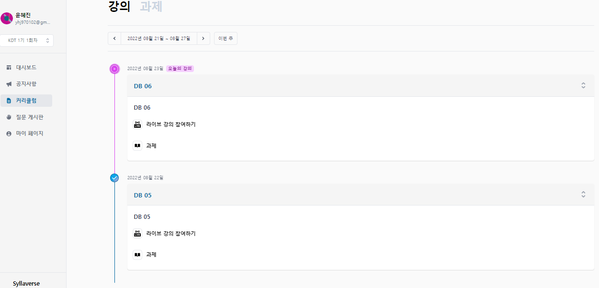

  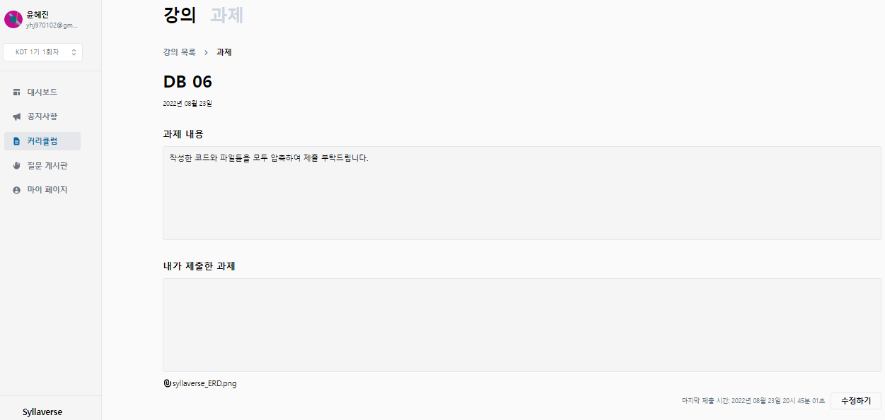

  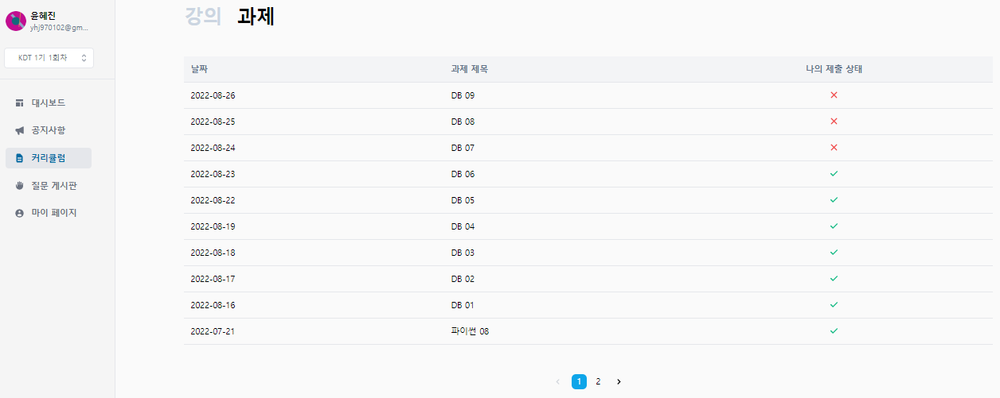

  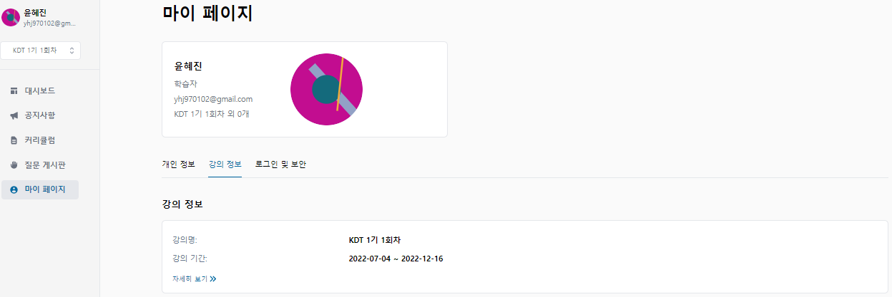

> 엑셀을 이용해 모델링 구상
  
1. 사용자 테이블

    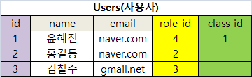

2. 훈련과정 정보 테이블

    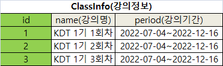

3. 역할 테이블
 
    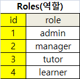

4. 강의 테이블
 
    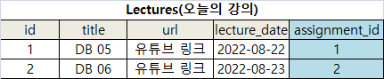

5. 과제 테이블

    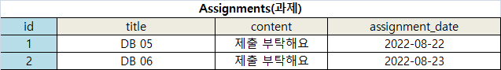

6. 과제 제출 목록 테이블

    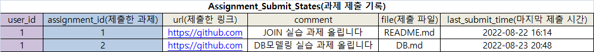

> ERD

.png)

## 2. 대학교 학사 관리 시스템
> 문제 설명

- 대학교의 학사관리시스템 기능을 ERD를 자유롭게 그려보자.
- 주요 Entity는 학생, 교수, 교과목
- 교과목은 교양/전공으로 구분되며, 강좌코드가 있음
- 교과목은 매년, 학기별로 개설됨
  - 한 교과목당 여러 강의가 개설될 수 있음
  - 단, 한 강의당 한 명의 교수가 담당
  - ex) 마케팅 원론 - 홍길동 교수, 마케팅 원론 - 김철수 교수
- 학생은 강의를 수강신청하며, 여러 강의를 동시에 들을 수 있음

> 엑셀을 이용해 모델링 구상

1. 생명대 학생 기본 정보 테이블
   
   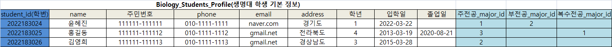

2. 생명대 교수 기본 정보 테이블
   
   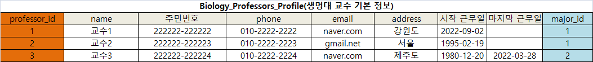

3. 단과대 테이블
   
   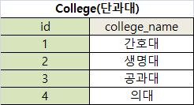

4. 전공 테이블
   
   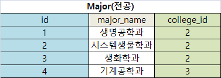

5. 강의실 테이블
   
   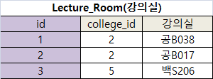

6. 교과목 테이블
   
   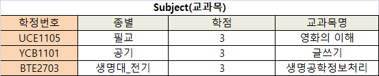

7. 2022학년도 1학기 개설교과목 테이블

   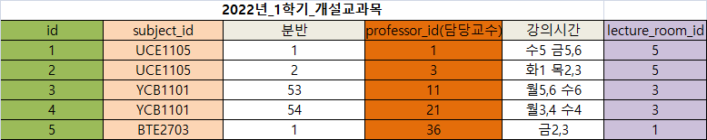

8. 2022학년도 1학기 수강신청 테이블
   
   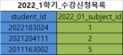

> ERD

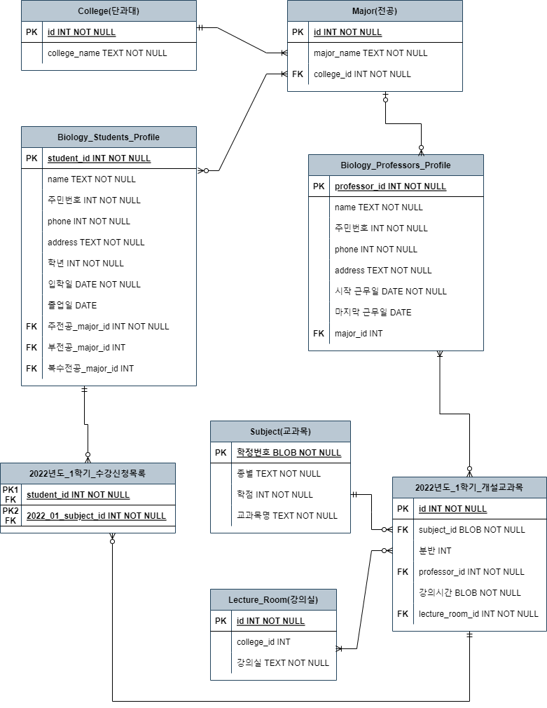