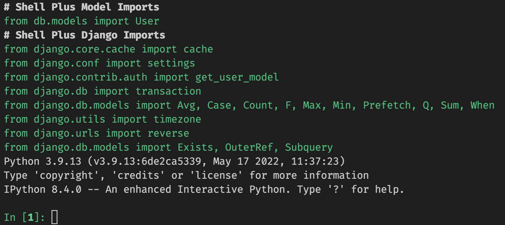

# [KDT] DB - ORM(Object Relational Mapping) 실습

## 🎯 목표
* ORM 이해
* Django Model 이해
* Django Queryset 이해
* 테이블 간 관계에 대한 이해와 Django에서의 관계 표현 방법

## 🔥 실습과정
1. [실습 환경 설정 및 실행 명령어](#-실습-환경-설정)
2. [실습 내용](#-실습-내용)

## ⚙ 실습 환경 설정
| 아래 명령어는 모두 터미널에서 수행해주세요.
### 가상환경

* 생성
    ```bash
    python -m venv venv
    ```

* 실행
    * windows
        ```bash
        . venv/Scripts/activate
        ```
    * mac
        ```zsh
        . venv/bin/activate
        ```

* 확인
    * 실행 전
    

    * 실행 후, `경로 위 혹은 왼쪽에 가상환경 이름 출력`
    

* 종료
    ```bash
    deactivate
    ```
    
### 패키지 설치
| 아래의 모든 명령어는 가상환경을 실행한 상태로 진행하세요. 
* 가상환경 실행
   * windows
        ```bash
        . venv/Scripts/activate
        ```
    * mac
        ```zsh
        . venv/bin/activate
        ```
* pip install
    ```bash
    pip install -r requirements.txt 
    ```

* django 패키지 설치 확인
    ```bash
    python manage.py --version
    # 4.0.6
    ```

### 모델 마이그레이션
```bash
python manage.py makemigrations

python manage.py migrate
```

### django shell
* shell 진입
    ```bash
    python manage.py shell_plus
    ```

* 진입 확인



### 파일 실행
| 파일을 실행할 때에는 가상환경을 실행한 상태인지 꼭 확인합니다.
```bash
python main.py
```


## License
The MIT License (MIT) Copyright (c) 2022 Dan Caron

Permission is hereby granted, free of charge, to any person obtaining a copy of this software and associated documentation files (the "Software"), to deal in the Software without restriction, including without limitation the rights to use, copy, modify, merge, publish, distribute, sublicense, and/or sell copies of the Software, and to permit persons to whom the Software is furnished to do so, subject to the following conditions:

The above copyright notice and this permission notice shall be included in all copies or substantial portions of the Software.

THE SOFTWARE IS PROVIDED "AS IS", WITHOUT WARRANTY OF ANY KIND, EXPRESS OR IMPLIED, INCLUDING BUT NOT LIMITED TO THE WARRANTIES OF MERCHANTABILITY, FITNESS FOR A PARTICULAR PURPOSE AND NONINFRINGEMENT. IN NO EVENT SHALL THE AUTHORS OR COPYRIGHT HOLDERS BE LIABLE FOR ANY CLAIM, DAMAGES OR OTHER LIABILITY, WHETHER IN AN ACTION OF CONTRACT, TORT OR OTHERWISE, ARISING FROM, OUT OF OR IN CONNECTION WITH THE SOFTWARE OR THE USE OR OTHER DEALINGS IN THE SOFTWARE.


## 🛠 실습 내용

<aside>
💡 코드를 작성한 실습 파일을 압축해서 실라버스에 제출해주세요.
</aside>

### 1. `db/models.py` 파일에 아래의 모델 2개 `Director`, `Genre` 를 작성하세요.

> 기본 코드

```python
class Director(models.Model):
    name = models.TextField()
    debut = models.DateTimeField()
    country = models.TextField()

class Genre(models.Model):
    title = models.TextField()
```

### 2. 모델을 마이그레이트(migrate) 하세요.

```bash
# 가상환경 실행 확인 후 아래 명령어를 터미널에 입력합니다.
python manage.py makemigrations

python manage.py migrate
```

### 3. Queryset 메소드 `create` 를 활용해서  `Director` 테이블에 아래 데이터를 추가하는 코드를 작성하세요.

| name | debut | country |
| --- | --- | --- |
| 봉준호 | 1993-01-01 | KOR |
| 김한민 | 1999-01-01 | KOR |
| 최동훈 | 2004-01-01 | KOR |
| 이정재 | 2022-01-01 | KOR |
| 이경규 | 1992-01-01 | KOR |
| 한재림 | 2005-01-01 | KOR |
| Joseph Kosinski | 1999-01-01 | KOR |
| 김철수 | 2022-01-01 | KOR |

> 코드 작성

```python
# Director 테이블에 추가할 데이터 (순서대로 name, debut, contry)
data = [
    ('봉준호', '1993-01-01', 'KOR'), 
    ('김한민', '1999-01-01', 'KOR'),
    ('최동훈', '2004-01-01', 'KOR'),
    ('이정재', '2022-01-01', 'KOR'),
    ('이경규', '1992-01-01', 'KOR'),
    ('한재림', '2005-01-01', 'KOR'),
    ('Joseph Kosinski', '1999-01-01', 'KOR'),
    ('김철수', '2022-01-01', 'KOR')
]

# Director 테이블에 데이터 삽입(Create)
for name_, debut_, country_ in data:
    Director.objects.create(name=name_, debut=debut_, country=country_)
```

### 4. `인스턴스 조작` 을 활용하여`Genre` 테이블에 아래 데이터를 추가하는 코드를 작성하세요.

| title |
| --- |
| 액션 |
| 드라마 |
| 사극 |
| 범죄 |
| 스릴러 |
| SF |
| 무협 |
| 첩보 |
| 재난 |

> 코드 작성

```python
# Genre 테이블에 추가할 데이터
data = ['액션', '드라마', '사극', '범죄', '스릴러', 'SF', '무협', '첩보', '재난']

# Genre 테이블에 데이터 삽입(Create)
for title_ in data:
    Genre.objects.create(title=title_)
```

### 5. Queryset 메소드 `all` 을 활용해서 `Director` 테이블의 모든 데이터를 출력하는 코드를 작성하세요.

> 출력 예시
> 

```
봉준호 1993-01-01 00:00:00 KOR
김한민 1999-01-01 00:00:00 KOR
최동훈 2004-01-01 00:00:00 KOR
이정재 2022-01-01 00:00:00 KOR
이경규 1992-01-01 00:00:00 KOR
한재림 2005-01-01 00:00:00 KOR
Joseph Kosinski 1999-01-01 00:00:00 KOR
김철수 2022-01-01 00:00:00 KOR
```

> 코드 작성

```python
datas = Director.objects.all()

for data in datas:
    print(data.name, data.debut, data.country)
```

### 6. Queryset 메소드 `get` 을 활용해서 `Director` 테이블에서 `id` 가 1인 데이터를 출력하는 코드를 작성하세요.

> 출력 예시

```
봉준호 1993-01-01 00:00:00 KOR
```

> 코드 작성

```python
data = Director.objects.get(id=1)
print(data.name, data.debut, data.country)
```

### 7. Queryset 메소드 `get` 을 활용해서 `Director` 테이블에서 `country` 가 USA인 데이터를 출력하는 코드를 작성하세요.

> 코드 작성

```python
data = Director.objects.get(country='USA')
```

### 8. 위 문제에서 오류가 발생합니다. 출력된 오류 메세지와 본인이 생각하는 혹은 찾은 오류가 발생한 이유를 작성하세요.

> 오류 메세지

```bash
DoesNotExist: Director matching query does not exist.
```

> 이유 작성

```
get() 메서드의 결과로서 반환되는 값이 없기 때문에 오류 발생함
```

### 9. Queryset 메소드 `get` 과 `save` 를 활용해서 `Director` 테이블에서  `name` 이 Joseph Kosinski인 데이터를 조회해서 `country` 를 USA 로 수정하고, 출력하는 코드를 작성하세요.

> 출력 예시

```
Joseph Kosinski 1999-01-01 00:00:00 USA
```

> 코드 작성

```python
data = Director.objects.get(name='Joseph Kosinski')
data.country = 'USA'
data.save()
```

### 10. Queryset 메소드 `get` 을 활용해서 `Director` 테이블에서 `country` 가 KOR인 데이터를 출력하는 코드를 작성하세요.

> 코드 작성

```python
datas = Director.objects.get(country='KOR')

for data in datas:
    print(data.name, data.debut, data.country)
```

### 11. 위 문제에서 오류가 발생합니다. 출력된 오류 메세지와 본인이 생각하는 혹은 찾은 오류가 발생한 이유를 작성하세요.

> 오류 메세지

```bash
MultipleObjectsReturned: get() returned more than one Director -- it returned 7!
```

> 이유 작성

```
get() 메서드가 2개 이상의 object를 반환하려고 했기 때문에 오류 발생
```

### 12. Queryset 메소드 `filter` 를 활용해서 `Director` 테이블에서 `country` 가 KOR인 데이터를 출력하는 코드를 작성하세요.

> 출력 예시

```
봉준호 1993-01-01 00:00:00 KOR
김한민 1999-01-01 00:00:00 KOR
최동훈 2004-01-01 00:00:00 KOR
이정재 2022-01-01 00:00:00 KOR
이경규 1992-01-01 00:00:00 KOR
한재림 2005-01-01 00:00:00 KOR
김철수 2022-01-01 00:00:00 KOR
```

> 코드 작성

```python
datas = Director.objects.filter(country='KOR')

for data in datas:
    print(data.name, data.debut, data.country)
```

### 13. 본인이 생각하는 혹은 찾은 `get` 과 `filter` 의 차이를 작성하세요.

```
get() 메서드는 없거나 2개 이상의 값이 반환될 때 오류를 발생한다.
값이 없거나 2개 이상의 값을 반환하기 위해서는 get()이 아닌 filter() 메서드를 사용하면 QuerySet 형태로 여러 개의 값을 반환가능하다.
```

### 14. Queryset 메소드 `get` 과 `delete`를 활용해서  `Director` 테이블에서 `name` 이 김철수인 데이터를 삭제하는 코드를 작성하세요.

> 코드 작성

```python
data = Director.objects.filter(name='김철수')
data[0].delete()
```